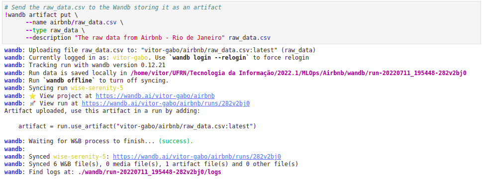
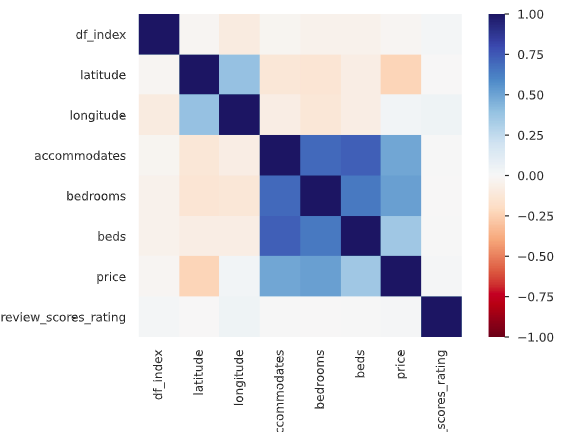

# Introdução

Este projeto consiste em realizar uma análise dos preços do Airbnb levando em consideração a cidade do Rio de Janeiro. A ideia final do projeto é, a partir de um conjunto de informações básicas da residência, poder estimar o preço médio por dia dessa residência. Isto é, resolver um problema de regressão.

Inicialmente, neste projeto, iremos realizar o pré-processamento dos dados, salvando diferentes versões do dataset no *wandb*, e realizando uma análise estatística para definir quais seriam as principais variáveis que podem ser utilizadas na solução do problema.

Em seguida, o dataset será separado em treinamento e teste, para então treinar um novo modelo e realizar o *deploy* do mesmo online.

Os passos a serem tomados para a solução desse problema e descritos nesse arquivo foram baseados no curso de [MLOPS de Ivanovitch](https://github.com/ivanovitchm/mlops). 

# Instalação de dependências

Antes de realizar a execução dos scripts em Python, será necessário realizar a instalação de algumas dependências. 

Para facilitar este processo, iremos inicialmente criar um Ambiente Virtual (*Virtual Environment*) que será utilizado para executar todos os projetos envolvendo MLOps.

A vantagem da utilização desses ambientes virtuais é a possibilidade de instalar versões específicas das bibliotecas apenas dentro deste ambiente, sem alterar as configurações do computador como um todo. Assim, é possível criar ambientes específicos para cada aplicação desejada com diferentes versões.

Esse ambiente será criado através do [Anaconda](https://www.anaconda.com/products/distribution). Para instalar essa distribuição, deve-se seguir os passos fornecidos em seu website. Uma vez que o Anaconda estiver instalado, siga os seguintes passos:

1. Criar um ambiente virtual chamado *mlops* com as dependências descritas dentro do arquivo *environment.yml*:

```
conda env create --file environment.yml
```

Autorize a criação do ambiente, quando requisitado.

2. Ativar o ambiente:

```
conda activate mlops
```

# EDA (Exploratory Data Analysis)

Uma vez que o ambiente no conda já esteja instalado e ativado na sua máquina, será realizado uma análise dos dados com o objetivo de descobrir padrões, perceber anomalias, tratar dados faltantes e estabelecer as variáveis mais relevantes para solucionar o problema. Além disso, a medida que novas versões do dataset forem criadas, as mesmas serão salvas no *wandb*. 

Inicialmente, é necessário executar o *mlflow* levando em consideração os arquivos nesta pasta. Isto é feito através do seguinte comando:

```
mlflow run .
```

Ao executar este comando, os comandos dentro do arquivo *MLproject* serão executados. Neste momento, temos apenas a instrução para executar o *Jupyter*, assim, uma nova aba no seu navegador será aberta mostrando todos os arquivos do projeto. O EDA foi desenvolvido utilizando o notebook *EDA.ipynb*. Toda a discussão a seguir leva em consideração este arquivo.

Inicialmente, foi necessário instalar algumas outras bibliotecas adicionais utilizando o pip, sendo elas o *seaborn*, *sklearn*, *pandas_profiling* e *ipywidgets*. Após a instalação deles, importamos todas as bibliotecas que serão utilizadas neste programa.

O próximo passo envolve realizar a leitura do dataset *listings.csv*, que está incluído na pasta do projeto, utilizando o *Pandas*. Este dataset está disponibilizado em [Ivanovitch Silva, Google Drive](https://drive.google.com/file/d/16zF4MHEP_bBxAEWpQgVocPupTjRRAgfP/view). Em seguida, este dataset completo é salvo no *wandb* como um artefato, conforme mostra a figura abaixo.



Dessa forma, já é possível carregar o dataset completo em alguma outra seção e por outra pessoa utilizando o *wandb*. Esse processo pode demorar dependendo do tamanho do dataset e da velocidade da internet.

## Análise do Dataset

O dataset original possui 24548 amostras e 74 *features*. A priori, tentou-se utilizar o *Pandas Profilling* no dataset inteiro, mas, em função da grande quantidade de dados e da capacidade limitada do computador utilizado, o *notebook* travava depois de um certo tempo de processamento.

Todavia, muitas colunas do dataset original são irrelevantes para predizer o preço médio diário de um Airbnb, como *ids*, *url* das residências, descrição do *host*, além de colunas sem nenhum dado. Assim, fez-se uma análise inicial das colunas do dataset e selecionou-se aquelas com uma maior relevância em relação a variável a ser predita. Essa escolha foi feita com base na experiência do autor em resolver problemas semelhantes a esse. Vale salientar que isso não significa que TODAS as *features* escolhidas serão utilizadas para predizer o preço final, mas representa apenas um filtro inicial para fazer uma análise estatística mais aprofundada.

As seguintes colunas foram selecionadas: **latitude, longitude, neighbourhood_cleansed, room_type, accommodates, bathrooms, bedrooms, beds, price, review_scores_rating**.

Após essa seleção, foi necessário realizar um pré-processamento na variável *price* para que pudessemos realizar uma comparação com as outras *features*. Assim, fez-se o seguinte pré-processamento dessa variável:

* Transformar de uma variável do tipo String para numérica: removendo o '$', ',' e convertendo para float.
* Filtrar anomalias, como casos onde o preço é igual a 0, ou maior do que 5.000 reais (existe uma residência cujo o valor é de 650.476 reais).
* Remover valores inválidos *not a number* (*NaN*). 

Essa versão do dataset será salva no *wandb* como *dataset_preprocessed1*. Em seguida, utilizamos o Pandas Profilling para ter mais informações estatísticas das variáveis. Entre essas, uma análise interessante que pode ser feita é **correlação de Pearson**, que evidencia a relação entre as variáveis selecionadas, conforme ilustrado na figura abaixo. 



As colunas *latitude*, *longitude* e *review_scores_rating* não possuem uma alta correlação (positiva ou negativa) com a variável *price* e, portanto, não serão consideradas daqui em diante. Por outro lado, as variáveis *accommodates*, *bedrooms*, *beds* e *price* possuem uma correlação positiva significativa entre si e, portanto, serão consideradas nas próximas etapas. Além disso, embora as variáveis *neighbourhood_cleansed* (representa a informação do bairro) e *room_type* (tipo de quarto) não estejam sendos mostrados, ambas também serão consideradas nas próximas etapas. 

Uma nova versão será do dataset será salva considerado uma limpeza das colunas mencionadas (com excessão de *price* que já foi processada para conseguirmos analisar com o Pandas Profilling). Para essa versão, iremos fazer o tratamento dos dados através da remoção de amostras com dados faltantes e da remoção anomalias. Essa nova versão será salva novamente como o arquivo *dataset_preprocessed1*.


# Dataset de teste e treinamento 

O dataset de teste e treinamento será dividido em uma proporção de 30% e 70%, respectivamente. Ambos os datasets também foram salvos no *wandb*.

