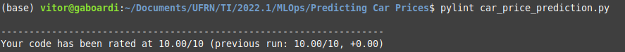

# Introdução

Neste projeto, será aplicado boas práticas de programação em *Machine Learning* considerando o estudo de caso de **predição de preços de carros** utilizando KNN.

# Organização

* CarPricePrediction.ipynb: Notebook com a solução para a realizar a predição de preços de carros. Referência: [Dataquest](https://github.com/dataquestio/solutions/blob/master/Mission155Solutions.ipynb)
* carpriceprediction-v1.py: Script Python com os códigos do Notebook (sem nenhuma adaptação).
* car_price_prediction.py: Script Python para realizar a predição de preços de carro levando em consideração boas práticas de programação.
* import-85.data: Dataset utilizado neste projeto. Referência: [UCI](https://archive.ics.uci.edu/ml/datasets/automobile)

# Instalação de dependências

Antes de realizar a execução dos scripts em Python, será necessário realizar a instalação de algumas dependências. 

Para facilitar este processo, iremos inicialmente criar um Ambiente Virtual (*Virtual Environment*) que será utilizado para executar todos os projetos envolvendo MLOps.

A vantagem da utilização desses ambientes virtuais é a possibilidade de instalar versões específicas das bibliotecas apenas dentro deste ambiente, sem alterar as configurações do computador como um todo. Assim, é possível criar ambientes específicos para cada aplicação desejada com diferentes versões.

Esse ambiente será criado através do [Anaconda](https://www.anaconda.com/products/distribution). Para instalar essa distribuição, deve-se seguir os passos fornecidos em seu website. Uma vez que o Anaconda estiver instalado, siga os seguintes passos:

1. Criar um ambiente virtual chamado *mlops*:

```
conda create --name mlops
```

Autorize a criação do ambiente, quando requisitado.

2. Ativar o ambiente:

```
conda activate mlops
```

3. Instalar as seguintes dependências: *pandas*, *numpy*, *scikit-learn*, *matplotlib*, *pylint*:

```
conda install pandas numpy scikit-learn matplotlib pylint
```
Novamente, autorize a instalação das dependências quando requisitado.

Ao finalizar as instalações, é possível executar o projeto através dos comandos abaixo.

# Execução

O arquivo *carpriceprediction-v1.py* obteve uma nota de **4.36/10** pelo *pylint*. Após modificar seguindo as recomendações, obteve-se uma nota 10/10, conforme mostrado na figura abaixo. O arquivo *car_price_prediction.py* contém essas modificações.



* Para verificar a nota do código seguindo o *pylint*, basta digitar o seguinte comando:

```
pylint car_price_prediction.py
```

* Para executar o código, basta digitar o seguindo comando:

```
python3 car_price_prediction.py
```

Quando o código acima for executado, será impresso os resultados do RSME (*Root Mean Square Error*) em função do tipo de modelo (univariável ou multivariável) e da quantidade de vizinhos (*k*). Além disso, duas figuras resumindo esses valores em função do valor de *k* serão salvas dentro da pasta *imagem*.

