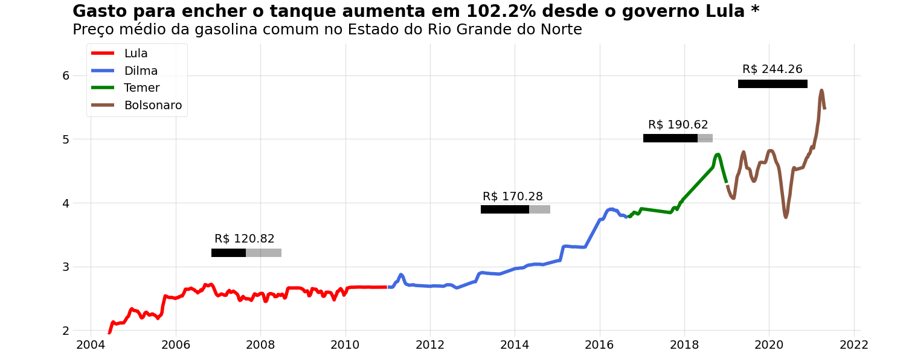

# Introdução

Neste projeto, será realizado a implementação de um programa que cria uma imagem a partir de uma base de dados comparando o preço da **gasolina comum** no estado do Rio Grande do Norte entre os anos de 2004 a 2021, destacando os governos de cada período.

# Dataset

A criação da figura foi feita com base no dataset disponibilizado por [Matheus Eduardo Freitag](https://www.kaggle.com/datasets/matheusfreitag/gas-prices-in-brazil?resource=download). Esse dataset possui dezoito colunas com informações que incluem data, preço médio, região e estado.


# Principios de código limpo

O código foi desenvolvido levando em consideração boas práticas de programação. Os programas serão compilados utilizando o *Anaconda*. Para realizar a criação de um novo ambiente virtual que rode o programa, basta ler o arquivo README do projeto *Predicting car prices*.

## Pylint

Obteve-se uma nota de 10.0/10.0 no *pylint*, conforme mostrado na figura abaixo.


* Para verificar a nota do código seguindo o *pylint*, basta digitar o seguinte comando:

```
pylint gas_prices_brazil.py
```

## Pytest

Foram realizados quatro testes para verificar o comportamento do programa: três deles estão relacionados com a leitura da base de dados e o quarto  verifica se o resultado do cálculo da média móvel representa valores numéricos. Os testes estão definidos dentro do arquivo *test_gas_prices_brazil.py*.

Para instalar o *pytest*, ative o ambiente virtual do conda e execute o comando abaixo:

```
conda install pytest
``` 

Para executar os testes, execute o seguinte comando:

```
python -m pytest test_gas_prices_brazil.py
``` 

Ao executar o comando acima, um *feedback* sobre os testes será mostrado no terminal. Se todos os testes forem aprovados, o resultado mostrado será parecido com o mostrado na figura abaixo:


# Execução


* Para executar o código e criar a imagem, basta executar o comando abaixo:

```
python3 gas_prices_brazil.py
```

# Resultado

Ao executar o programa, obtem-se a figura mostrada abaixo, que mostra a média de preço da gasolina comum entre os anos de 2014 a 2021 destacando o mandato dos respectivos presidentes.




Considerou-se uma média móvel igual a quatro para a criação da imagem. Tal valor foi escolhido para que cada ponto da figura representasse uma média mensal, visto que cada valor da base de dados representa a média semanal.

Além disso, após aplicar o valor médio do preço para cada presidente, obteve-se os seguintes resultados:

* Lula: R$ 2.52 
* Dilma: R$ 3.07
* Temer: R$ 4.13
* Bolsonaro: R$ 4.60

*OBS: Valores computados considerados foram entre Maio de 2004 e Abril de 2021 no estado do Rio Grande do Norte.*

# Streamlit

Com o objetivo de visualizar de uma maneira interativa o gráfico proposto, criou-se uma aplicação no [StreamLit](https://streamlit.io/)

Para instalar o streamlist, basta executar o comando abaixo logado no ambiente virtual do anaconda:

```
pip install streamlit
``` 

Em seguida, para rodar o programa desenvolvido (*streamlit_app.py) basta executar o seguinte comando:

```
streamlit run streamlit_app.py
``` 

Isso irá permitir a visualização do projeto no browser através de uma URL Local e uma URL externa. No dashboard desenvolvido, é possível ver com mais detalhes as informações mostradas no gráfico, como por exemplo dar zoom e verificar o preço exato de um ponto da curva, conforme ilustrado na figura abaixo, onde é possível verificar que no dia 25 de janeiro de 2020, o preço médio da gasolina no Rio Grande do Norte estava em 4,809 reais.


